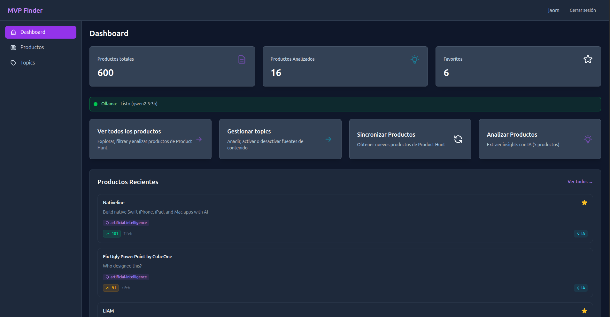
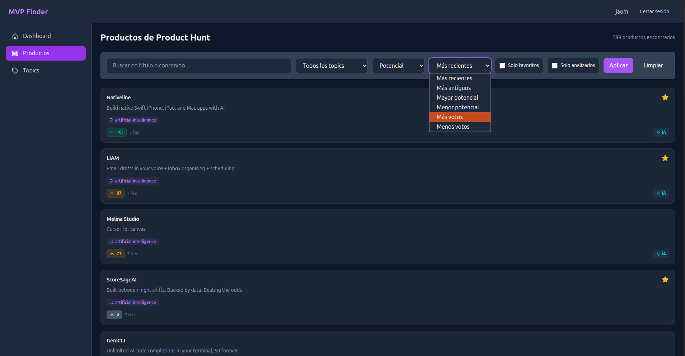
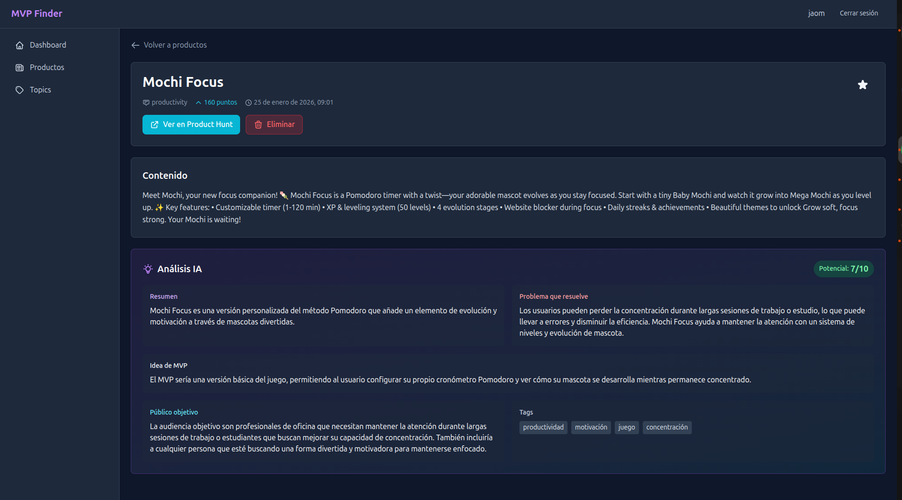
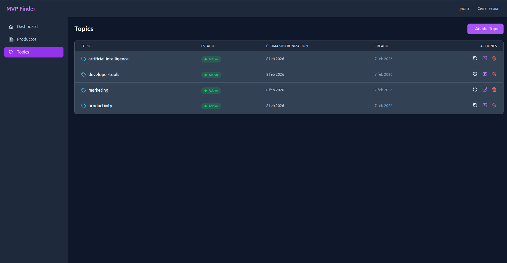

# MVP Finder

Aplicacion web para descubrir oportunidades de negocio analizando productos de Product Hunt con inteligencia artificial local. Agrega, filtra y analiza productos para identificar problemas reales, generar ideas de MVP y evaluar su potencial de mercado.

Desplegado en produccion sobre una [Raspberry Pi 5](https://github.com/Jaolmos/raspberry-python-lab-server) que funciona como servidor web y laboratorio de pruebas.

## Screenshots

### Dashboard


### Productos


### Detalle de producto


### Topics


## Caracteristicas

- **Sincronizacion con Product Hunt** -- Importacion automatica de productos por topics via GraphQL API
- **Analisis IA local** -- Ollama (qwen2.5:3b) genera resumen, problema que resuelve, idea de MVP, publico objetivo, puntuacion de potencial y tags
- **Favoritos y notas personales** -- Marca productos interesantes y anade notas privadas por producto
- **Filtros avanzados** -- Por topic, estado de analisis, favoritos, potencial minimo y busqueda por texto
- **Ordenamiento multiple** -- Por fecha, votos o puntuacion de potencial (ascendente/descendente)
- **Busqueda en tiempo real** -- Filtrado instantaneo mientras se escribe
- **Autenticacion JWT** -- Login con refresh automatico de tokens
- **API REST documentada** -- Swagger UI disponible en `/api/docs/`
- **Notificaciones toast** -- Feedback visual en todas las acciones del usuario
- **Seguridad** -- Headers CSP, X-Frame-Options, X-Content-Type-Options

## Stack tecnologico

| Capa | Tecnologia |
|------|------------|
| Backend | Django 5.2 + Django Ninja |
| Frontend | Vue.js 3 + TypeScript + Pinia |
| Estilos | Tailwind CSS v4 |
| Base de datos | PostgreSQL 16 |
| Cache | Redis 7 |
| Tareas asincronas | Celery + Flower |
| IA local | Ollama (qwen2.5:3b) |
| API externa | Product Hunt (GraphQL via httpx) |
| Contenedores | Docker Compose |
| Python | 3.14 (gestionado con uv) |

## Requisitos previos

- Docker y Docker Compose
- Una API key de [Product Hunt](https://www.producthunt.com/v2/oauth/applications)

## Instalacion

```bash
git clone https://github.com/Jaolmos/mvp-finder.git
cd mvp-finder
```

Copiar el archivo de variables de entorno y configurar las credenciales:

```bash
cp .env.example .env
```

Editar `.env` con tus credenciales de Product Hunt y ajustar las variables de base de datos si es necesario.

Levantar los servicios:

```bash
docker compose up -d
```

Aplicar migraciones y crear un superusuario:

```bash
docker compose exec backend uv run manage.py migrate
docker compose exec backend uv run manage.py createsuperuser
```

Descargar el modelo de IA:

```bash
docker compose exec ollama ollama pull qwen2.5:3b
```

## Uso

Una vez levantados los servicios, acceder a:

| Servicio | URL |
|----------|-----|
| Frontend | http://localhost:5173 |
| API Docs (Swagger) | http://localhost:8000/api/docs |
| Admin Django | http://localhost:8000/admin |
| Flower (monitor Celery) | http://localhost:5555 |

Flujo basico:

1. Iniciar sesion con el superusuario creado
2. Crear topics en la seccion Topics (ej: `artificial-intelligence`, `developer-tools`)
3. Sincronizar productos desde el Dashboard
4. Lanzar el analisis IA desde el Dashboard o desde el detalle de un producto individual

## Tests

Backend (121 tests con pytest):

```bash
docker compose exec backend uv run pytest -v
```

Frontend (164 tests con Vitest):

```bash
docker compose exec frontend npm run test:unit -- --run
```

## Produccion

El proyecto incluye configuracion lista para despliegue en produccion:

- `docker-compose.prod.yml` con builds multi-stage optimizados (Gunicorn + Nginx)
- `.env.prod.example` como plantilla de variables de entorno para produccion
- WhiteNoise para servir archivos estaticos
- Headers de seguridad configurados en Nginx

```bash
cp .env.prod.example .env
# Editar .env con valores de produccion

docker compose -f docker-compose.prod.yml build
docker compose -f docker-compose.prod.yml up -d
```

## Estructura del proyecto

```
mvp_finder/
├── backend/
│   ├── apps/
│   │   ├── posts/          # Modelo Product y notas
│   │   ├── topics/         # Topics de Product Hunt
│   │   ├── scraper/        # Cliente API + tareas Celery + analisis IA
│   │   └── users/          # Autenticacion JWT
│   └── config/             # Settings, API root, URLs
├── frontend/
│   ├── src/
│   │   ├── views/          # Vistas (Dashboard, Products, Topics, Login)
│   │   ├── stores/         # Pinia stores
│   │   ├── services/       # Clientes API (Axios)
│   │   ├── composables/    # Hooks reutilizables
│   │   └── layouts/        # AppLayout, AuthLayout
│   └── package.json
├── docker/
│   ├── backend/            # Dockerfile dev + prod
│   └── frontend/           # Dockerfile dev + prod + nginx.conf
├── docker-compose.yml      # Desarrollo
├── docker-compose.prod.yml # Produccion
├── .env.example            # Variables de entorno (desarrollo)
└── .env.prod.example       # Variables de entorno (produccion)
```

## Licencia

MIT
